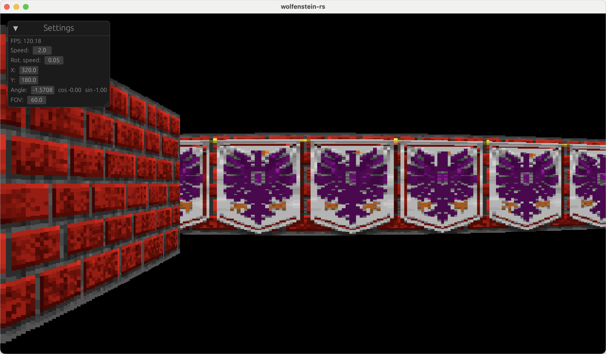
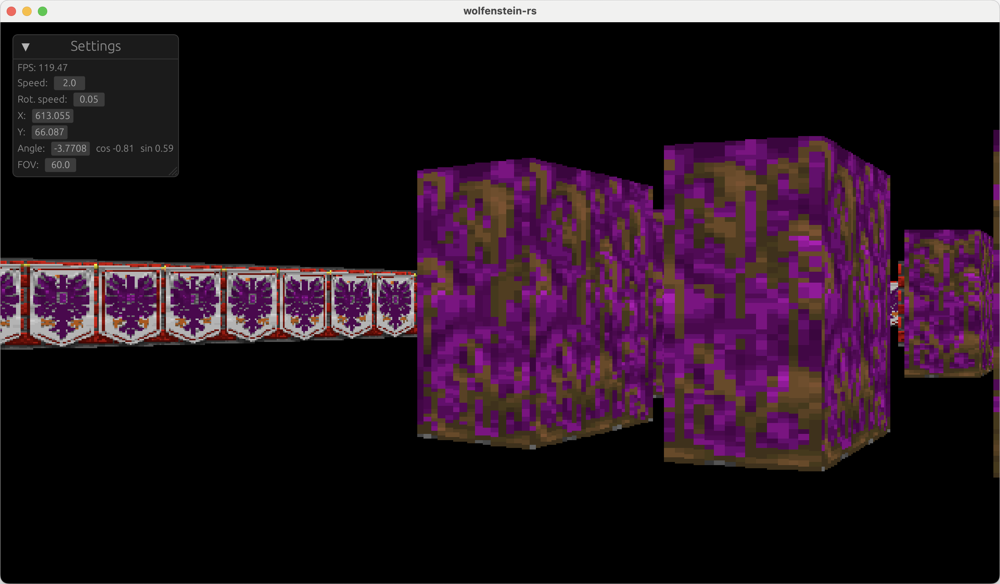

# wolfenstein-rs

Very poorly written Wolfenstein remake in Rust.

## Running

```bash
git clone https://github.com/cestef/wolfenstein-rs.git
cd wolfenstein-rs
cargo run --release
```

## Controls

- `W` - Move forward
- `S` - Move backward
- `A` - Strafe left
- `D` - Strafe right
- `Q` - Turn left
- `E` - Turn right
  
## Screenshots


